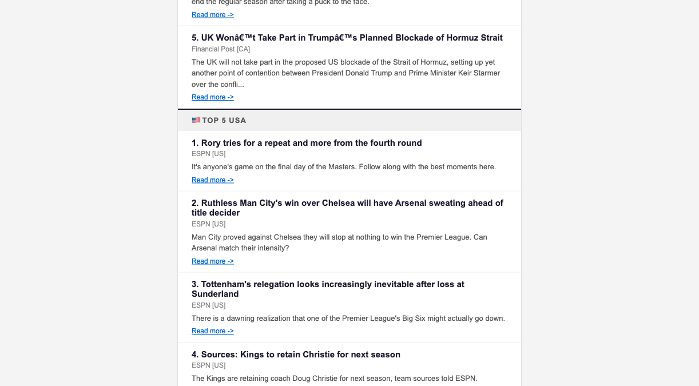

# Autonomous News Intelligence

[](https://github.com/nammnjoshii/autonomous-news-intelligence/actions/workflows/daily-news.yml)
[](https://github.com/nammnjoshii/autonomous-news-intelligence/actions/workflows/weekly-audit.yml)

A fully automated, zero-cost news intelligence pipeline delivered to your inbox every morning. Built with Python and GitHub Actions. No servers. No subscriptions. No maintenance.

Built by [Nammn Joshii](https://www.linkedin.com/in/nammnjoshii/) — Senior Technical Program and Delivery Manager. A personal production system: zero-ops, zero-cost, running daily since March 2026.

**Status:** Running daily since March 2026 · Delivered every morning at 7 AM Pacific · [Actions log](https://github.com/nammnjoshii/autonomous-news-intelligence/actions)

---

## What It Does

Pulls RSS feeds across 9 categories, deduplicates and ranks stories by recency and source credibility, detects emerging trends across the day's corpus, and sends a clean HTML email every morning before you open your laptop.

**Categories:** Technology · Finance · Economy · Business · Politics · World · Health · Sports · Entertainment

**Stories per category:** Up to 5, ranked by composite score (recency + credibility).

**Delivery:** 7 AM Pacific via Resend free tier.

**Cost:** $0.

---

## Why This Exists

Most news aggregators optimize for engagement. This one optimizes for signal-to-noise: geographic relevance (BC-first), source credibility weighting, and cross-category deduplication. It runs unattended, costs nothing, and pages me only when something actually breaks.

---

## Architecture

```
RSS Feeds (URL Pool per category, 3–5 sources)
        ↓
Feed State Cache    →    Load known-healthy / known-dead URLs (GitHub Actions cache)
        ↓
Feed Validator      →    Try pool in order → autodiscover on total failure → save updated state
        ↓
Collector           →    Parse titles, summaries, links, dates, sources
        ↓
Deduplicator        →    Exact match → Fuzzy match (difflib ≥ 0.85)
        ↓
Scorer              →    recency_score + credibility_score → top 5 per category
        ↓
Cross-Category      →    Normalize scores → top 5 overall
        ↓
Trend Detector      →    Keyword frequency → flag topics in 3+ stories
        ↓
HTML Generator      →    Mobile-friendly email, inline CSS
        ↓
Resend              →    Deliver to recipient
        ↓
Archiver            →    Save to /digests/, prune files > 90 days
```

---

## Email Output

Live digest — rendered and delivered daily. Geographic tagging ([CA], [BC], [US]) applied automatically based on NER and signal matching.




---

## File Structure

```
autonomous-news-intelligence/
│
├── main.py                   # Core pipeline: fetch → dedupe → rank → email
├── validate_feeds.py         # Preflight: try URL pool, autodiscover on failure, save state
├── feed_discovery.py         # Auto-discovers feed URL from site homepage when pool fails
├── audit_feeds.py            # Weekly audit: retest all feeds fresh, rebuild state cache
├── archive.py                # Save digest + prune old files
├── config.py                 # Scoring weights, thresholds, timezone
├── requirements.txt          # Python dependencies
├── rss_feeds.json            # Feed registry: URL pool (3–5), category, credibility, site root
├── README.md                 # This file
├── ARCHITECTURE.md           # Engineering reference: pipeline logic, schemas, conventions
├── tests/
│   └── test_pipeline.py      # Unit tests for pure pipeline functions
│
│   # feed_state.json — runtime only, never committed
│   # Persisted between runs via GitHub Actions cache (key: feed-state-v1)
│
├── .github/
│   └── workflows/
│       ├── daily-news.yml    # Daily cron workflow (includes cache restore/save)
│       └── weekly-audit.yml  # Weekly feed health audit (every Sunday)
│
└── digests/
    └── YYYY-MM-DD.html       # Rolling 90-day archive of sent digests
```

---

## Prerequisites

- Python 3.11+
- A free [Resend account](https://resend.com) with a verified sender email
- A GitHub repository with Actions enabled
- A sending domain with DNS access (for SPF/DKIM — takes 30 minutes, required for inbox delivery)

---

## Setup

### 1. Clone the Repository

```bash
git clone https://github.com/nammnjoshii/autonomous-news-intelligence.git
cd autonomous-news-intelligence
```

### 2. Install Dependencies

```bash
pip install -r requirements.txt
```

### 3. Configure Resend

1. Create a free account at [resend.com](https://resend.com).
2. Go to **API Keys → Create API Key**.
3. Name it (e.g., `autonomous-news-intelligence`), set permission to **Sending access**.
4. Copy the key. You will not see it again.
5. Go to **Domains** and add your sending domain, or use Resend's shared domain (`onboarding@resend.dev`) for testing only. Use your own domain for production.

### 4. Configure GitHub Secrets

In your repository, go to **Settings → Secrets and variables → Actions → New repository secret**.

Add these three secrets:

| Secret Name | Value |
|---|---|
| `RESEND_API_KEY` | Your Resend API key |
| `RECIPIENT_EMAIL` | Your personal email address |
| `SENDER_EMAIL` | Your verified Resend sender address |

These are never stored in code or config files. The pipeline reads them as environment variables at runtime.

### 5. Configure SPF and DKIM (Required for Inbox Delivery)

Without this step, your digest will land in spam.

**SPF:** Add a TXT record to your sending domain's DNS:
```
v=spf1 include:amazonses.com ~all
```

**DKIM:** In Resend, go to **Domains → your domain → DNS Records**. Resend provides the exact CNAME records to add. Propagation takes up to 48 hours.

Verify both are active before enabling the cron schedule.

### 6. Validate Your Feeds

Before running the full pipeline, confirm all feeds are live:

```bash
python validate_feeds.py
```

Output will flag any dead or empty feeds. Update `rss_feeds.json` with working alternatives before proceeding.

### 7. Test the Pipeline Manually

```bash
export RESEND_API_KEY=your_key_here
export RECIPIENT_EMAIL=your_email@example.com
export SENDER_EMAIL=sender@yourdomain.com

python main.py
```

Confirm the email arrives in your inbox — not spam — before enabling the scheduled workflow.

---

## Configuration

### Scoring Weights (`config.py`)

```python
# Adjust these weights to change ranking behavior.
# Must sum to 1.0.

RECENCY_WEIGHT = 0.6       # Freshness. Linear decay over 48 hours.
CREDIBILITY_WEIGHT = 0.4   # Source quality. Scored 1–5 in rss_feeds.json.

# Deduplication
FUZZY_MATCH_THRESHOLD = 0.85   # SequenceMatcher ratio. Lower = more aggressive dedup.

# Trend detection
TREND_MIN_APPEARANCES = 3      # Minimum story appearances to flag a keyword as trending.
TREND_TOP_N = 5                # Number of trending keywords to surface in the email.

# Archive
ARCHIVE_RETENTION_DAYS = 90   # Daily digests older than this are auto-deleted.
```

### Feed Registry (`rss_feeds.json`)

Each entry follows this schema:

```json
{
  "name": "TechCrunch",
  "category": "Technology",
  "urls": [
    "https://techcrunch.com/feed/",
    "https://www.theverge.com/rss/index.xml",
    "https://feeds.arstechnica.com/arstechnica/index"
  ],
  "site_root": "https://techcrunch.com",
  "credibility_score": 4,
  "region": "usa",
  "active": true
}
```

- `urls`: Ordered pool of 3–5 feed URLs. Tried in sequence at runtime; first working URL wins. Add more to make a category more resilient.
- `site_root`: Canonical homepage. Used by the autodiscovery system to find a new feed URL if all `urls` fail. Must be the actual HTML page (not a redirect or CDN URL).
- `active: false`: Disables the entry without deleting it.

**Credibility scoring guide:**

| Score | Meaning |
|---|---|
| 5 | Primary source — Reuters, BBC, AP, NPR |
| 4 | Established trade/vertical press — TechCrunch, Politico, ESPN |
| 3 | Reputable secondary sources — CBC, MarketWatch |
| 2 | Aggregators or mixed-quality sources |
| 1 | Use as last resort in pool |

Assign scores once during setup. Revisit quarterly or when you notice ranking drift.

### Timezone

The cron expression in `daily-news.yml` runs at **3 PM UTC**, which equals 7 AM PST.

Adjust for PDT (summer):
```yaml
- cron: '0 14 * * *'   # 2 PM UTC = 7 AM PDT
```

Or use a seasonal comment in the workflow file to remind yourself to update it at DST transitions.

---

## GitHub Actions Workflow

The pipeline uses two workflows: a daily digest workflow and a weekly feed audit.

### Daily Digest (`daily-news.yml`)

```yaml
name: Autonomous News Intelligence — Daily Digest

on:
  schedule:
    - cron: '0 15 * * *'   # 3 PM UTC = 7 AM PST
  workflow_dispatch:         # Manual trigger for testing

jobs:
  send-digest:
    runs-on: ubuntu-latest
    steps:
      - name: Checkout repo
        uses: actions/checkout@v4

      - name: Setup Python
        uses: actions/setup-python@v5
        with:
          python-version: '3.11'

      - name: Install dependencies
        run: pip install -r requirements.txt

      - name: Restore feed state cache
        uses: actions/cache@v4
        with:
          path: feed_state.json
          key: feed-state-v1
          restore-keys: feed-state-

      - name: Validate feeds
        run: python validate_feeds.py

      - name: Save feed state cache
        uses: actions/cache/save@v4
        if: always()
        with:
          path: feed_state.json
          key: feed-state-v1-${{ github.run_id }}

      - name: Run digest pipeline
        env:
          RESEND_API_KEY: ${{ secrets.RESEND_API_KEY }}
          RECIPIENT_EMAIL: ${{ secrets.RECIPIENT_EMAIL }}
          SENDER_EMAIL: ${{ secrets.SENDER_EMAIL }}
        run: python main.py

      - name: Archive digest
        run: python archive.py

      - name: Commit archive
        uses: stefanzweifel/git-auto-commit-action@v5
        with:
          commit_message: "digest: $(date +'%Y-%m-%d')"
          file_pattern: digests/
```

### Weekly Feed Audit (`weekly-audit.yml`)

Runs every Sunday. Retests all feed URLs fresh (ignores cached state), runs autodiscovery for any dead ones, and rebuilds the state cache. Check the Actions tab → **Weekly Feed Audit** → latest run → **Step Summary** to see which categories are healthy and what was discovered.

```yaml
name: Weekly Feed Audit

on:
  schedule:
    - cron: '0 10 * * 0'   # Every Sunday 10 AM UTC
  workflow_dispatch:

jobs:
  audit-feeds:
    runs-on: ubuntu-latest
    steps:
      - uses: actions/checkout@v4
      - uses: actions/setup-python@v5
        with:
          python-version: '3.11'
      - run: pip install -r requirements.txt

      - name: Restore feed state cache
        uses: actions/cache@v4
        with:
          path: feed_state.json
          key: feed-state-v1
          restore-keys: feed-state-

      - name: Run feed audit
        run: python audit_feeds.py

      - name: Save refreshed feed state cache
        uses: actions/cache/save@v4
        if: always()
        with:
          path: feed_state.json
          key: feed-state-v1-audit-${{ github.run_id }}
```

**Error notifications:** If any step exits with a non-zero code, GitHub Actions marks the run as failed and sends an email notification to your GitHub account automatically. No extra alerting setup required.

Trigger a manual run anytime from the **Actions** tab → select workflow → **Run workflow**.

---

## Pre-Launch Checklist

Complete these in order before enabling the scheduled cron.

- [ ] Add 3–5 URLs to the `urls` pool for each category in `rss_feeds.json`
- [ ] Set `site_root` for every entry in `rss_feeds.json`
- [ ] Run `validate_feeds.py` — at least one URL per category returns content
- [ ] Run `python audit_feeds.py` locally to confirm autodiscovery works for your sources
- [ ] Assign credibility scores to all sources in `rss_feeds.json`
- [ ] Verified sender domain active in Resend (or using onboarding@resend.dev for first test)
- [ ] SPF record added to DNS
- [ ] DKIM records added and verified in Resend
- [ ] All three GitHub Secrets added to the repository
- [ ] Manual run via `workflow_dispatch` succeeds end-to-end
- [ ] Email arrives in inbox (not spam)
- [ ] Cron UTC offset matches your local timezone

---

## Email Layout

```
─────────────────────────────────────────
[Weekday, Month DD YYYY] — Your Daily Briefing
─────────────────────────────────────────

🔥 Emerging Signals
  AI · Federal Reserve · Biotech · ...

📌 Top 5 Overall Stories
  1. Headline — Source | Read more →
  2. ...

📂 Technology
  1. Headline — Source | Read more →
  2. ...

📂 Finance
  ...

(Repeats for all 9 categories)
─────────────────────────────────────────
Delivered 15:00 UTC · GitHub Actions
─────────────────────────────────────────
```

Inline CSS only. Mobile-first layout (max-width 600px). No external images. Renders correctly in Gmail, Outlook, and Apple Mail.

---

## Troubleshooting

**Email lands in spam.**
SPF or DKIM is not verified. Check DNS propagation with [MXToolbox](https://mxtoolbox.com/spf.aspx). Confirm DKIM records are verified inside Resend before retesting.

**A category shows fewer than 5 stories.**
The feed returned fewer items than expected. Check `validate_feeds.py` output. Add more URLs to that category's `urls` pool in `rss_feeds.json`.

**Pipeline fails silently.**
Check the Actions run log under the failed step. Common causes: expired Resend API key, all pool URLs dead and autodiscovery failed, or a malformed `rss_feeds.json` entry. Check the weekly audit step summary for feed health detail.

**Feed state cache was evicted.**
This is not a failure. The next daily run will re-test the full pool and re-run discovery as needed, then rebuild the cache automatically. No action required.

**Duplicates appearing in the digest.**
Lower `FUZZY_MATCH_THRESHOLD` in `config.py` (e.g., from 0.85 to 0.80) to increase deduplication aggressiveness. Test locally before pushing.

**Archive is not committing.**
Confirm the `stefanzweifel/git-auto-commit-action` step has write permissions. In repository **Settings → Actions → General**, set **Workflow permissions** to **Read and write**.

---

## Dependency Reference

```
feedparser==6.0.11        # RSS parsing
resend==2.4.0             # Email delivery
python-dateutil==2.9.0    # Date parsing and timezone handling
```

No heavy dependencies. No LLM APIs. No external databases. The entire pipeline runs inside a GitHub-hosted runner in under 60 seconds.

---

## License

MIT. Use it, fork it, modify it.

---

*Built to run quietly in the background and deliver signal, not noise.*
